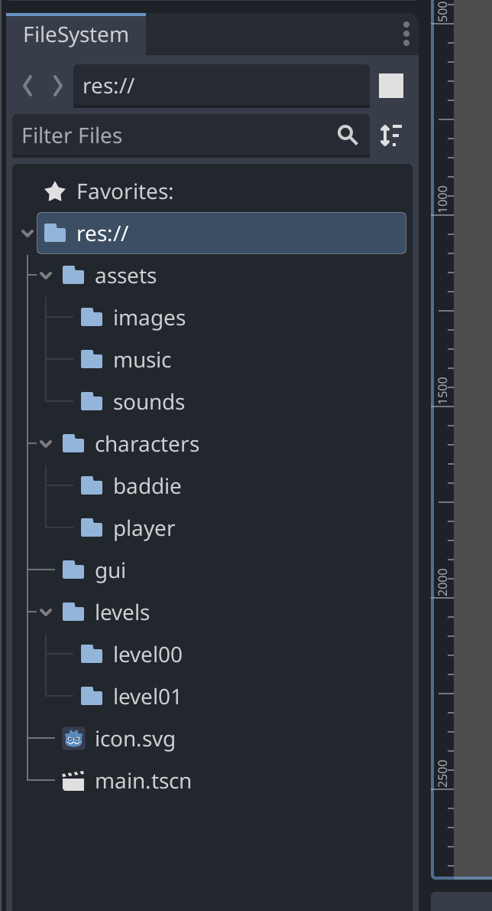
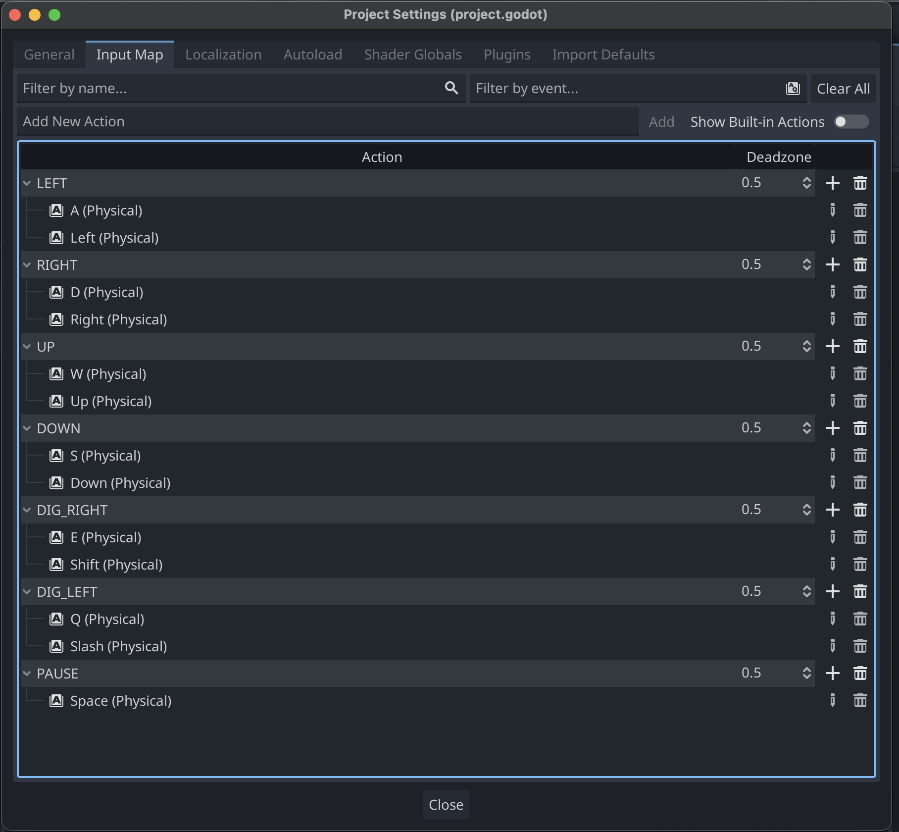

Devlog: 000

1. **Date and Session Information:**

January 9th, 2024

Getting started.

2. **Overview:**

Created the GitHub repo, and sync'd it to my computer:

https://github.com/BitsofJeremy/goLode

Created the basic file structures [builds, devlogs, game_assets, and project]

Grabbed some basic game assets from the inspiration site:
https://github.com/SimonHung/LodeRunner_TotalRecall.git

I will be using the images, sprite sheets, and sounds to flesh out the basics of the game.

In a Godot game directory structure I like to create the following for my game organization:

assets
 |-images
 |-music
 |-sounds
characters
 |-baddie
 |-player
gui
levels
 |-level00
 |-level01

Copy the example game assets into Godot directories.

Grab the player script from this template and put it in the player character directory:
https://clownfishcreations.itch.io/platformer-movement

Debating on if I want to use the scripts from Penguin Platformer, but that may be a bit more involved.

Going for a classic pixel game so grabbing Kenney's fonts for now:
  kenpixel_blocks.ttf
  kenpixel_mini.ttf

https://www.kenney.nl/assets/kenney-fonts

Drop them in the gui directory.

Setup the project to a resolution of 320x240
  Wasn't sure on this and will figure it out as I get the player in the game

Setup the keymap

Save and push for now.
