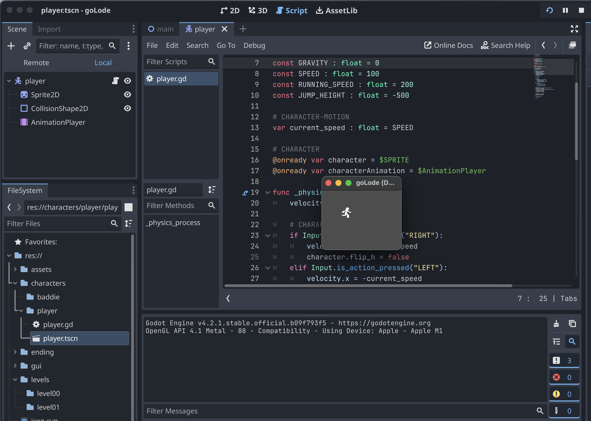
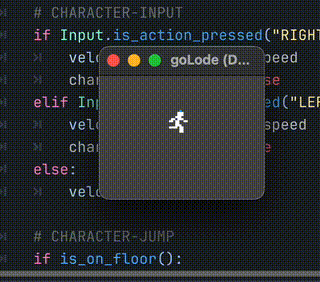
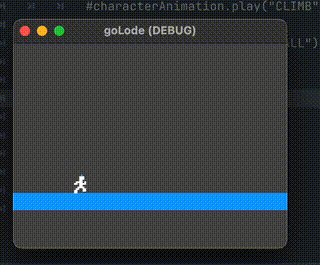

Devlog: 001

1. **Date and Session Information:**

January 10th 2024

Player scene work

**GOAL**

The goal for this session  is to get a player scene up and running


2. **Overview:**

Created a new Player scene in the characters/player directory

added the needed nodes [Character2d, CollisionShape2d, AnimationPlayer, Sprite2d]

created a capsule collision shape

attached the downloaded template for player controls
 - will need to adjust for this game and remove things like jumping

saved and added player to the main scene. After a few bugs was able to get the player to show





### Next get the player to move around without issue.

Set the game resolution to 640x480

Goal: Get the play to at least run...

I had the following uncommented and that was stopping the animation from playing:

```python
  # CHARACTER FALL OR CLIMB
  #if is_on_floor():
    #if velocity.y < 0:
      #characterAnimation.play("CLIMB")
    #else:
      #characterAnimation.play("FALL")
```
After commenting it out and saving, my player can run, HOORAY!





