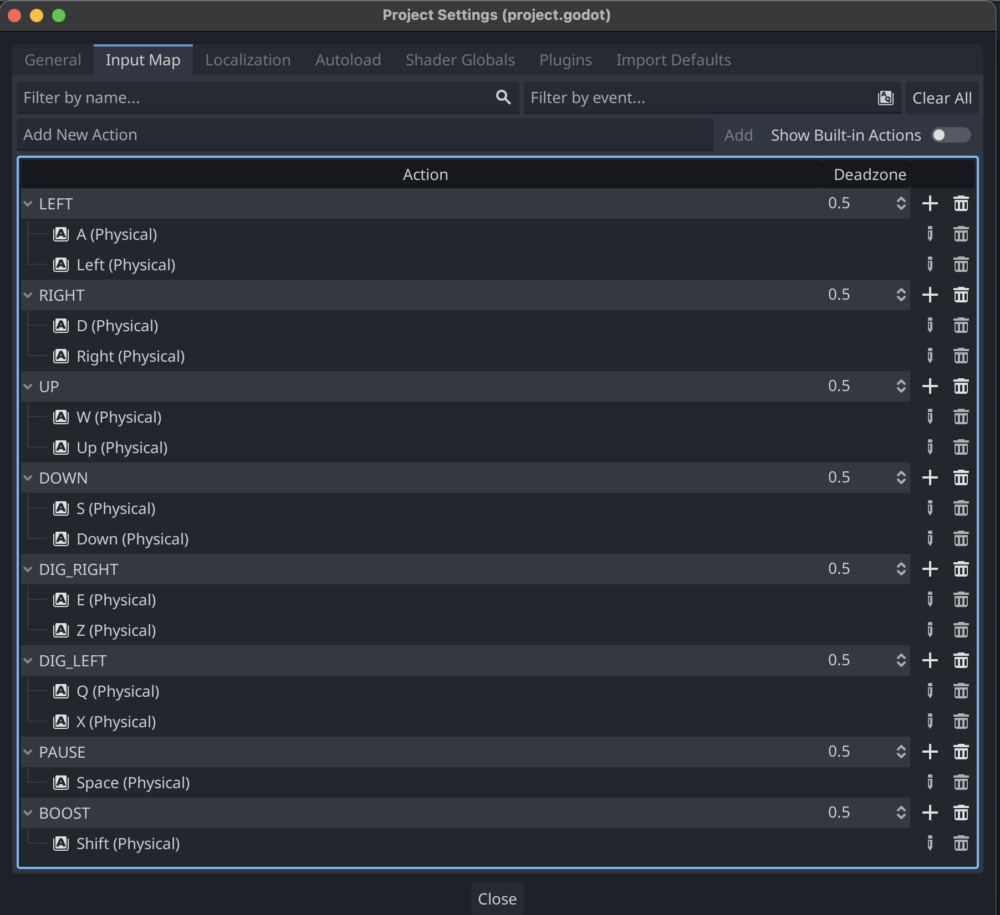
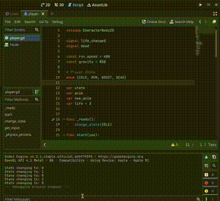

Devlog: 002

1. **Date and Session Information:**

January 16th 2024

Clean up game assets

**GOAL**

The goal for this session  is to clean out the images assets directory.


2. **Overview:**

I originally just pulled the image assets in without looking, and now need to get rid of things I will not be using
Also need to organize it for easier searching while developing.

Images organized in a new way:

```
assets
  |-images
    |-player
    |-ui
    |-baddie
    |-objects
```

I just am going with just the Apple theme from the repo as that is what I remember playing back in the day.

I also widdled down the sound effects, and added an opening menu music file to the assets directory for later on.

Ludum Dare 28 - Track 8.wav from Abstraction:
https://soundcloud.com/abstraction/abstraction-ludum-dare-28-6

**Coding**

I added BOOST to the keymap, and edited the others to make more sense for later playing.



I changed out the player script to add a state machine.
This is for future coding when I implement a ladder climbing and rope grappling features.

Currently, just set to the basic states.
I will get BOOST working in the next few sessions as extra credit work.

```python
# Player State
enum {IDLE, RUN, BOOST, DEAD}
```




